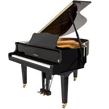

  <title>About Me</title>
  

  <!-- Header Section -->
  <header>
    Hey! I'm Tanav 🌟
  </header>

  <!-- Introduction Section -->
  

    <section>
      <h2>Who Am I?</h2>
      
who i am

    </section>
  

  <!-- Activities Section -->
  

    <section>
      <h2>What I like</h2>
      

        

          
          
I love to play the piano, and I have been playing for 5 years now. 

        

        

          
          
This is the language I speak at home, telugu. It is from south India

        

        

          
          
I also like to play basketball and follow the NBA

        

      

    </section>
  

  <!-- Goals Section -->
  

    <section>
      <h2>What's Next?</h2>
      
I’m always chasing new adventures and trying to figure out what's next. Right now, I’m all about [your current goal or project], and who knows where that’ll take me! 🚀

    </section>
  

  <!-- Contact Section -->
  

    <section>
      <h2>Wanna Chat?</h2>
      
Whether it's about [something you're into, e.g., "coding," "rockets," "cats"] or just to say hi, feel free to reach out! You can email me at <a href="mailto:your-email@example.com" class="fun-button">your-email@example.com</a>

    </section>
  

  <!-- Footer Section -->
  <footer>
    © 2024 [Your Name] | Powered by Coffee ☕
  </footer>

  <!-- JavaScript for Image Click -->
  

</html>
